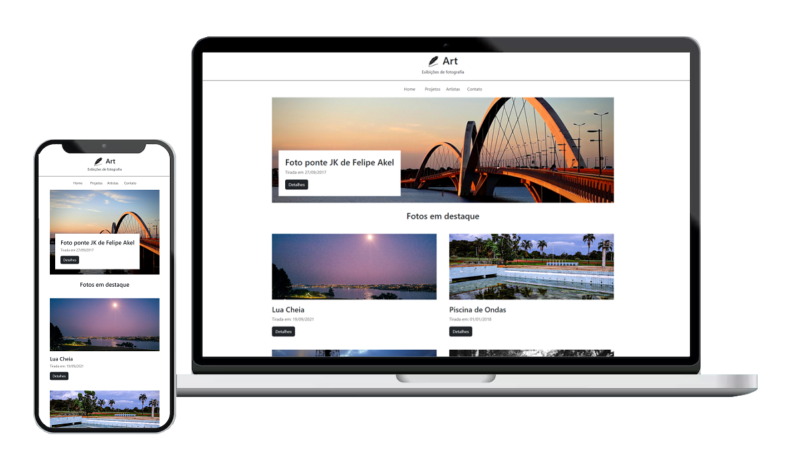
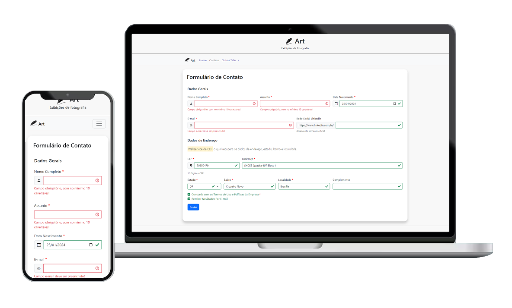

    
     

## Sobre Atr - Fotografia

O projeto Atr - Fotografia trata-se de construção de templates  utilizando o framework front-end Bootstrap 5. O layout foi elaborado em paralelo ao curso, Bootstrap 5 do básico ao avançado, para revisão dos principais componentes e extrair as melhores formas utilizar esta ferramenta.

Além disso, foi implementado recursos de validação de dados nos formulários antes do envio. Destaca-se, um serviço adicional de Webservice o qual irá recuperar os dados de endereço, estado, bairro e localidade através do dado CEP. Dessa forma, conseguimos ter uma validação no front-end da aplicação antes que ela seja enviada para o back-end.

### Templates
- Home [IMG](img/template/home.jpg)
- Contato [IMG](img/template/contato.png)
- Login [IMG](img/template/login.png)
- Cadastro de Login [IMG](img/template/cadastro-login.png)

## Tecnologias utilizadas

- **[Bootstrap 5](https://getbootstrap.com/)**
- **[Webservice - ViaCEP](https://viacep.com.br/)**

## Licença

A licença MIT foi aplicada ao projeto.